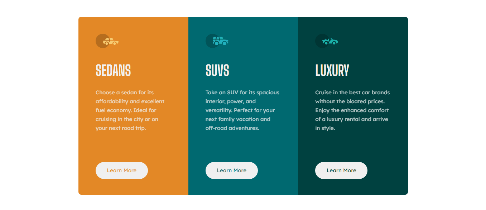
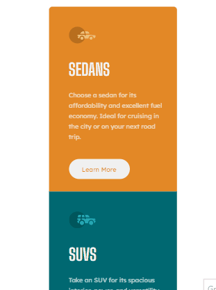

# Frontend Mentor - 3-column preview card component solution

Esta é uma solução para o desafio 3-column preview card component, um desafio do FrontendMentor, onde consiste em criar um projeto e parecer o mais proximo possivel do design.
Nele foi usado HTML e CSS com funcionalidades bem interessantes, de modo que o usuário consiga ver o projeto tanto no desktop quanto no mobile sem afetar a qualidade do código.
Obrigado por chegar até aqui, confira o código!

## Indice do conteúdo

- [Visão geral](#visão-geral)
  - [O desafio](#o-desafio)
  - [Captura de tela](#captura-de-tela)
- [Meu processo](#meu-processo)
  - [Construído com](#construído-com)
  - [O que eu aprendi](#o-que-eu-aprendi)
  - [Trecho de código](#trecho-de-código)
  - [Recursos úteis](#recursos-úteis)
- [Autor](#autor)

## Visão geral
### O desafio


### Captura de tela
<br>

- Resultado do desafio na versão desktop:



<br>

- Resultado do desafio na versão mobile:

<br>


### Links

- Solution URL: [Adicionar url do Github](https://your-solution-url.com)
- Live Site URL: [Add github pages](https://your-live-site-url.com)

## Meu processo

### Construído com

- Semantic HTML5 markup
- CSS custom properties
- Flexbox
- Mobile-first workflow

### O que eu aprendi

Nesse projeto envolvendo HTML e CSS, aprendi conceitos importantes. Através do CSS, aprendi a dar estilo e formatar elementos HTML, explorando propriedades como cores, fontes, posicionamento e responsividade. No processo de aprendizado, foi importante entender os conceitos fundamentais de cada linguagem. Praticar esses conceitos em projetos reais nos ajuda a aprimorar nossas habilidades e explorar diferentes técnicas e soluções para os desafios que encontramos.

### Trecho de código

```html
<li class="sedans">
      <span>
        
      </span>
      <h1>
        SEDANS
      </h1>
      <p>
        Choose a sedan for its affordability and excellent fuel economy. Ideal for cruising in the city
        or on your next road trip.
      </p>
      <button>
        Learn More
      </button>
```
```css
h1 {
    font-family: 'Big Shoulders Display', sans-serif;
    font-size: 40px;
    font-weight: 700;
    margin-top: 35px;    
}

p {
    font-family: 'Lexend Deca', sans-serif;
    font-size: 15px;
    font-weight: 400;
    font-style: normal;
    margin-right: 48px;
    margin-top: 25px;
    line-height: 25px;
    opacity: 0.75;
}

.sedans button:hover{
    border: 2px solid #FFF;
    background-color: var(--Bright-orange);
    color: #FFFFFF;
}

.suvs button:hover{
    border: 2px solid #FFF;
    background-color: var(--Dark-cyan);
    color: #FFFFFF;
}

.luxury button:hover{
    border: 2px solid #FFF;
    background-color: var(--Very-dark-cyan);
    color: #FFFFFF;
}
```

### Recursos úteis

- [Dev em Dobro](https://www.youtube.com/@DevemDobro) - Este é um canal onde encontro muito material. Tem muito conteúdo relacionado ao desenvolvimento. Recomendo a todos que querem aprender sobre esse e outros conceitos relacionados.


## Autor

- Website - [Paulo Carvalho](https://github.com/paulo1310)
- Frontend Mentor - [Paulo Carvalho](https://www.frontendmentor.io/profile/paulo1310)